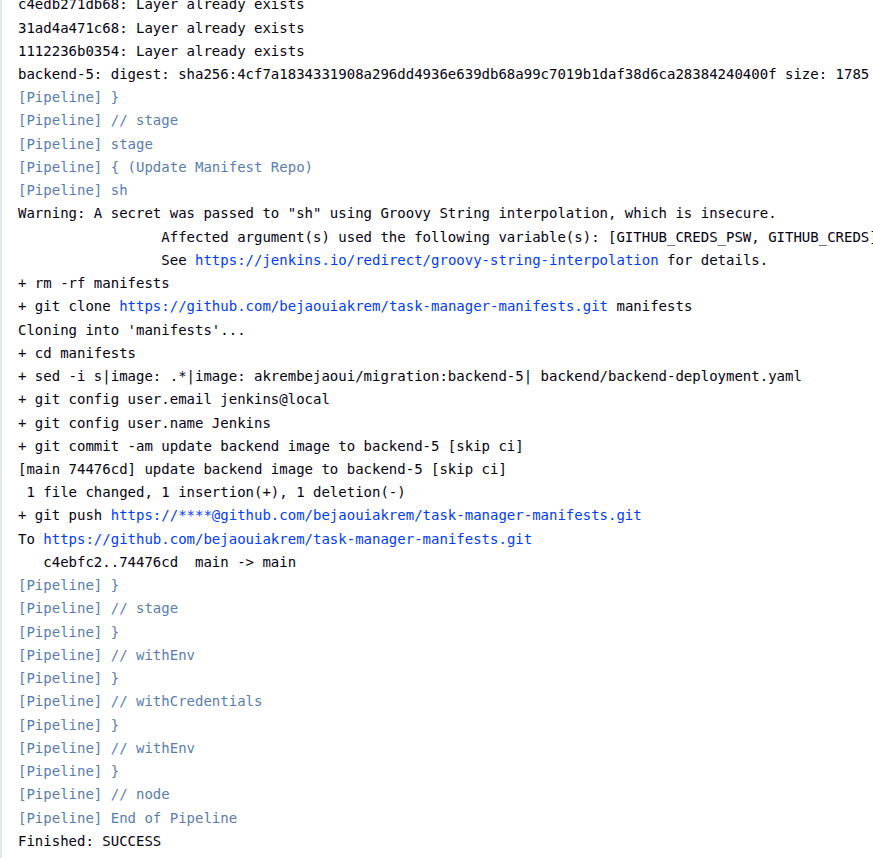
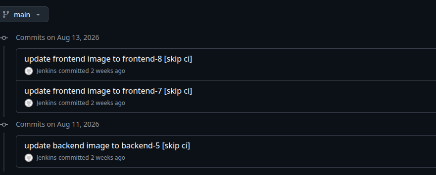
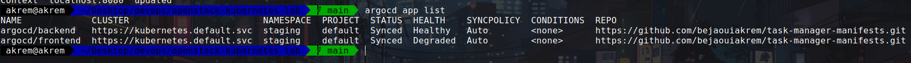
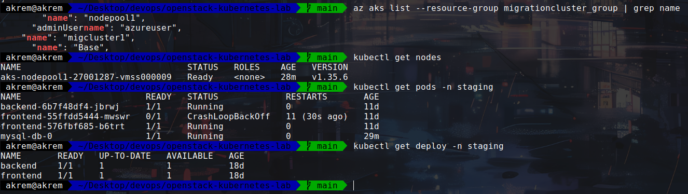

# Task Manager — Kubernetes & GitOps

Kubernetes manifests used to deploy my Task Manager application on **Azure Kubernetes Service (AKS)**.

The deployment workflow uses **Jenkins for CI** and **Argo CD for GitOps-based deployment**.

## 🚀 Deployment Workflow

```text
GitHub → Jenkins → Docker Image → Manifests → Argo CD → AKS
```

* **Jenkins** — builds the application and pushes the updated Kubernetes configuration
* **Docker** — containerizes the frontend and backend
* **Argo CD** — synchronizes the manifests from Git
* **AKS** — runs the application

## 📂 Structure

```text
├── backend
│   ├── backend-configmap.yaml
│   ├── backend-deployment.yaml
│   └── backend-service.yaml
├── frontend
│   ├── frontend-deployment.yaml
│   └── frontend-service.yaml
├── ingress
│   └── ingress.yaml
└── docs
    └── screenshots
```

## 📸 Deployment Evidence

### Jenkins — Successful Build



### Jenkins — Manifest Update



### Argo CD — Synced & Healthy



### Azure Resources



## 🛠️ Stack

`Azure AKS` · `Kubernetes` · `Docker` · `Jenkins` · `Argo CD` · `GitHub` · `Ingress`

## 🔗 Application Repositories

* [Frontend](https://github.com/bejaouiakrem/task-manager-frontend)
* [Backend](https://github.com/bejaouiakrem/task-manager-backend)
